# 📊 Proyecto de Análisis de Ventas con SQL (MySQL)

Este proyecto consiste en el desarrollo y análisis exploratorio (EDA) de una base de datos en *MySQL*, orientada al estudio de órdenes de venta.  

El objetivo principal fue aplicar consultas SQL para explorar la información, obtener métricas clave y reforzar fundamentos de análisis de datos trabajando sobre una estructura relacional.

---

## 🛠️ Herramientas utilizadas

- MySQL  
- MySQL Workbench  
- Lenguaje SQL  

---

## 🗂️ Contenido del repositorio

- Script completo de la base de datos en formato .sql
- Estructura de la tabla orders
- Datos cargados en la base
- Consultas analíticas desarrolladas durante el proyecto
- Backup exportado en archivo Self-Contained File

---

## 📈 Análisis realizados

Durante el proyecto se aplicaron:

- Consultas SELECT
- Filtros con WHERE
- Ordenamiento con ORDER BY
- Agrupaciones con GROUP BY
- Funciones de agregación como:
  - COUNT()
  - SUM()
- Uso de CASE WHEN para análisis condicional
- Cálculo de métricas derivadas (porcentajes)

Se realizaron análisis como:

- Total de registros
- Identificación de operaciones con pérdidas
- Cálculo del porcentaje de pérdidas
- Exploración general del comportamiento de los datos

---

## 🖼️ Resultados visuales

### 0. Consulta del periodo de ventas
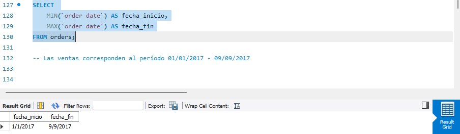

### 1. Validación inicial de datos
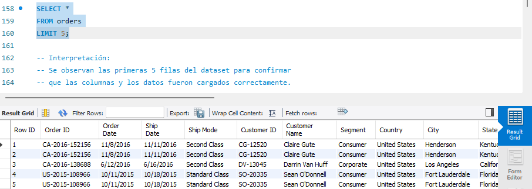

### 2. Validación y calidad de los datos
### 2.1. Verificación de valores nulos
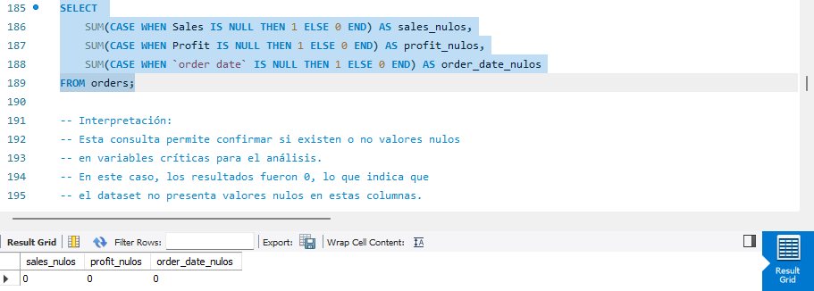

### 2.2. Verificación de registros duplicados
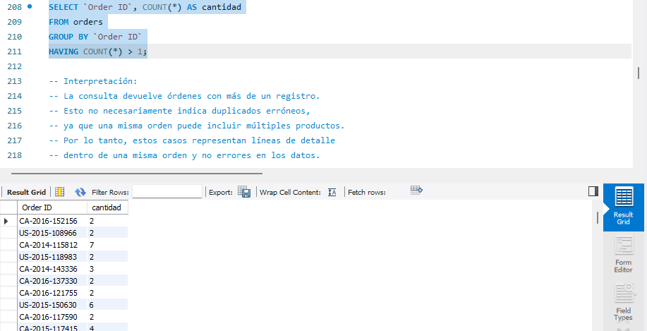

### 2.3. Verificación de valores negativos

### 2.4. Cuantificación de órdenes con pérdidas

### 2.5. Impacto porcentual de órdenes con pérdidas
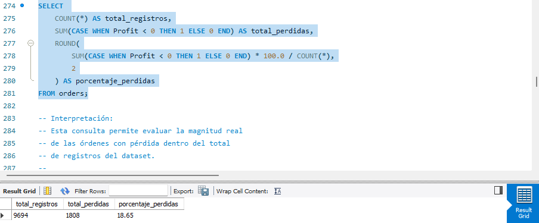
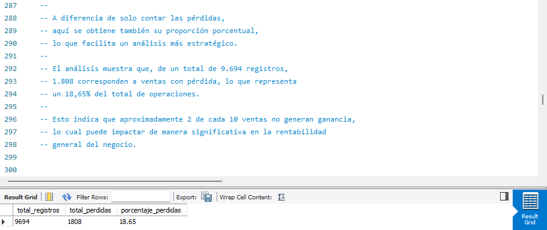

### 3. Cantidad total de registros
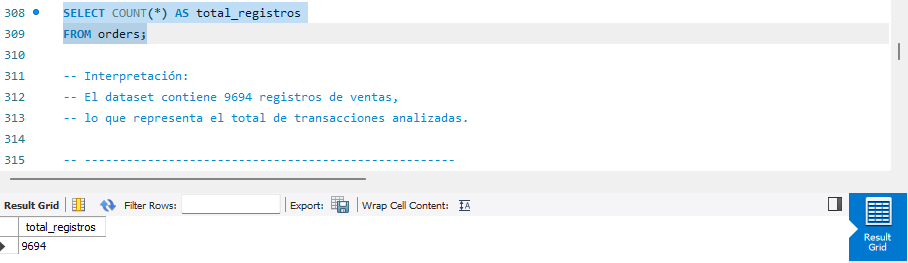

### 5. Ventas por categoría
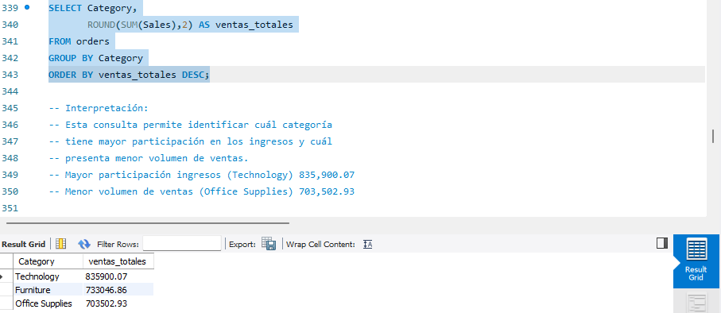

### 6. Ventas por región
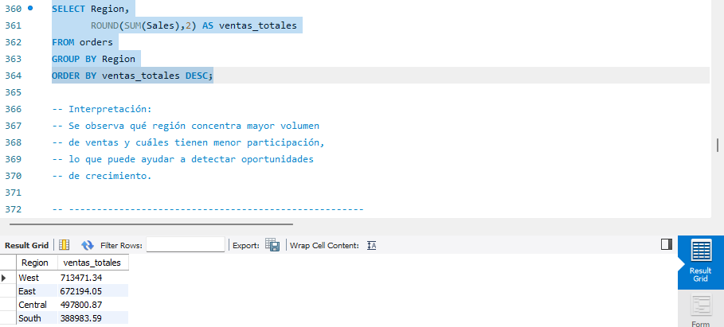

### 7. Top 10 clientes por volumen de compra
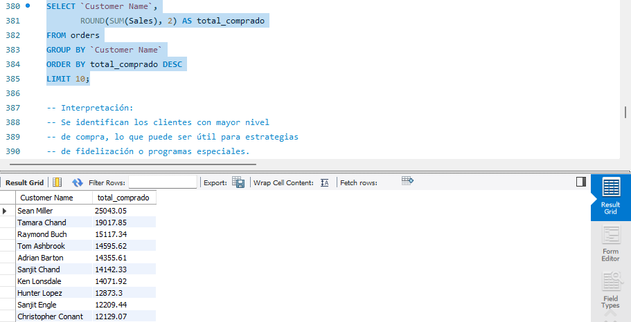

### 8. Rentabilidad por categoría
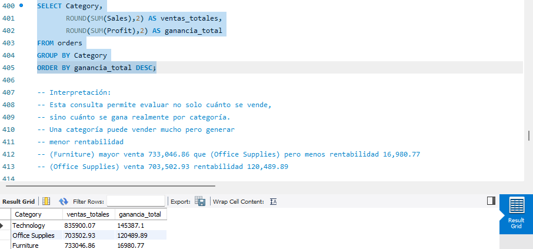

### 9. Ventas mensuales
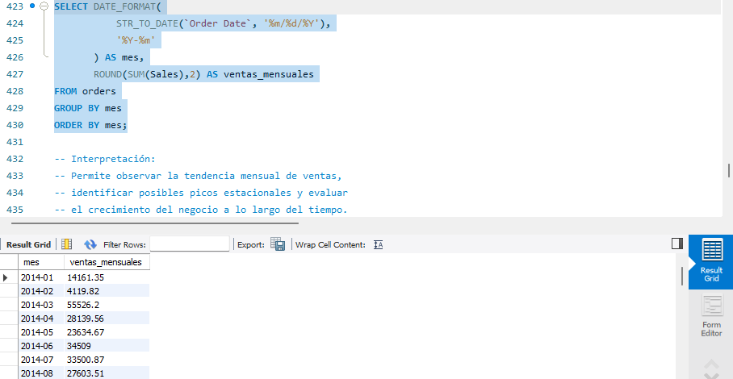

---

## 🎯 Habilidades demostradas

- Diseño y comprensión de base de datos relacional
- Exploración y análisis de datos con SQL
- Aplicación de lógica condicional en consultas
- Uso de funciones de agregación
- Organización estructurada de proyecto técnico
- Exportación y respaldo profesional de base de datos

---

## 📌 Alcance del proyecto

Este proyecto se enfoca en la exploración y análisis de datos mediante consultas SQL estructuradas, con el objetivo de consolidar fundamentos sólidos en manipulación, agregación y análisis descriptivo dentro de MySQL.

El trabajo se centra en la interpretación de información, cálculo de métricas clave y organización de resultados para su posterior documentación y presentación como proyecto de portafolio.

---

## 👨‍💻 Autor

Rubén Barrios  

Proyecto realizado como práctica de análisis de datos con SQL, orientado al desarrollo profesional en el área de Data Analytics.
